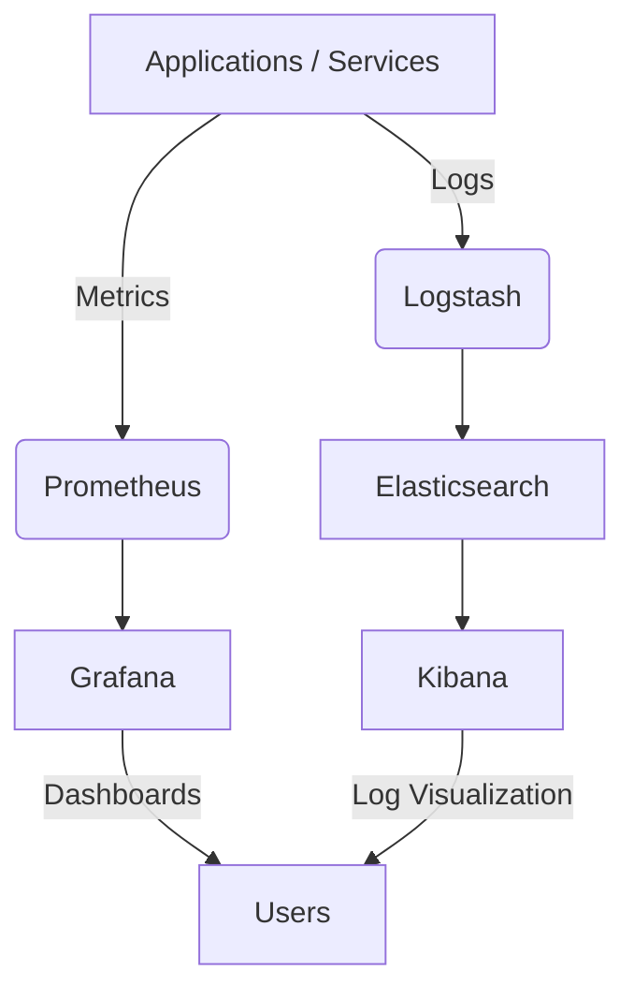

# Monitoring and Logging Report

## Introduction
This report covers the installation and setup of **Prometheus**, **Grafana**, and the **ELK Stack (Elasticsearch, Logstash, Kibana)**. These tools are widely used for monitoring and logging in modern infrastructure, enabling observability, visualization, and centralized log management.

---

## Prometheus Installation
1. **Update System Packages:**
   ```bash
   sudo apt update && sudo apt upgrade -y
   ```
2. **Download Prometheus:**
   ```bash
   wget https://github.com/prometheus/prometheus/releases/download/v2.52.0/prometheus-2.52.0.linux-amd64.tar.gz
   tar -xvf prometheus-2.52.0.linux-amd64.tar.gz
   cd prometheus-2.52.0.linux-amd64
   ```
3. **Run Prometheus:**
   ```bash
   ./prometheus --config.file=prometheus.yml
   ```
4. **Access Web UI:** [http://localhost:9090](http://localhost:9090)

---

## Grafana Installation
1. **Install Grafana:**
   ```bash
   sudo apt-get install -y apt-transport-https software-properties-common
   sudo add-apt-repository "deb https://packages.grafana.com/oss/deb stable main"
   sudo apt-get update
   sudo apt-get install grafana -y
   ```
2. **Start Service:**
   ```bash
   sudo systemctl start grafana-server
   sudo systemctl enable grafana-server
   ```
3. **Access Web UI:** [http://localhost:3000](http://localhost:3000) (default credentials: `admin/admin`)

---

## ELK Stack Installation
### Elasticsearch
1. **Install Elasticsearch:**
   ```bash
   wget -qO - https://artifacts.elastic.co/GPG-KEY-elasticsearch | sudo apt-key add -
   sudo apt-get install apt-transport-https
   echo "deb https://artifacts.elastic.co/packages/8.x/apt stable main" | sudo tee -a /etc/apt/sources.list.d/elastic-8.x.list
   sudo apt-get update && sudo apt-get install elasticsearch -y
   ```
2. **Start Service:**
   ```bash
   sudo systemctl enable elasticsearch
   sudo systemctl start elasticsearch
   ```

### Logstash
```bash
sudo apt-get install logstash -y
```

### Kibana
```bash
sudo apt-get install kibana -y
sudo systemctl enable kibana
sudo systemctl start kibana
```

Access Kibana UI: [http://localhost:5601](http://localhost:5601)

---

## Architecture Diagram


---

## Conclusion
- **Prometheus**: Metrics collection and alerting.
- **Grafana**: Visualization and dashboards.
- **ELK Stack**: Centralized logging and analysis.

This setup provides a complete monitoring and logging solution for any modern infrastructure.
